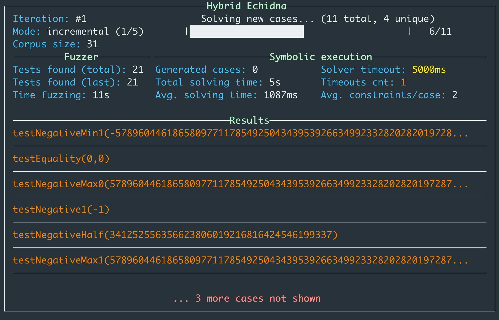

# Optik

**Optik** is a set of symbolic execution tools that assist smart contract fuzzers, letting them run in a _hybrid_ mode. Optik couples [Echidna](https://github.com/crytic/echidna), our smart contract fuzzer, with the [Maat](https://github.com/trailofbits/maat) symbolic executor that replays the fuzzing corpus and extends it with new inputs that increase coverage.

#### Current limitations

Optik is a work in progress and should not be used for real audits yet. Current limitations include:

- Symbolic `KECCAK` hashes are not supported
- `CREATE2`, `CALLCODE`, and `DELEGATECALL` are not yet supported
- Gas is not taken into account
- Some echidna options are not yet supported (see `hybrid-echidna -h`)

## Hybrid Echidna

<p align="center" >
 <br>
</p>

Optik allows to run the [Echidna](https://github.com/crytic/echidna) smart-contract 
fuzzer in _hybrid_ mode. It basically couples Echidna with the [Maat](https://github.com/trailofbits/maat) symbolic executor that replays the Echidna corpus and extends it with new inputs that increase coverage. 

`hybrid-echidna` starts with several _incremental seeding_ steps, where it seeds the corpus with short transactions sequences obtained by [Slither](https://github.com/crytic/slither)'s dataflow analysis, and uses symbolic execution more intensely to solve new inputs. The sequence length is incremented at each seeding step. Once it reaches a certain length threshold, `hybrid-echidna` falls back into its normal mode, starts to limit the number of symbolic inputs to solve, and stops using dataflow analysis for seeding the corpus.

### Usage

Hybrid echidna can be used seamlessly in place of regular Echidna by replacing `echidna-test` with `hybrid-echidna` in your Echidna command line. 
For example: 

```
hybrid-echidna MyContract.sol  --test-mode assertion --corpus-dir /tmp/test --contract MyContract
```

Additionnal options are available in hybrid mode to control `hybrid-echidna`'s behaviour:

- `--max-iters`: maximum number of fuzzing iterations to perform (one iteration is one Echidna campaign + one symbolic executor run on the corpus)

- `--solver-timeout`: maximum time in milliseconds to spend solving each possible new input

- `--incremental-threshold`: number of initial incremental seeding steps to perform

- `--no-incremental`: skip initial incremental seeding

- `--cov-mode`: type of coverage to increase when solving new inputs. Most coverage modes are implemented for experimental purposes. Unless you are developing/hacking on Optik, we recommend to keep the default mode

Debugging, logging and terminal display:

- `--debug`: add debugging information to the log output

- `--logs`: write logs to a given file (or `stdout`)

- `--no-display`: disable the graphical terminal display

## Installation

We plan on publishing a `PyPI` package for `pip` installation when Optik becomes more stable.
For now you can install it by running:

```console
git clone https://github.com/crytic/optik && cd optik
python3 -m pip install .
```

or you can run it from Docker:

```console
git clone https://github.com/crytic/optik && cd optik
docker build -t crytic/optik .
docker run -it --rm --mount type=bind,source="$(pwd)",target=/workdir crytic/optik
# This runs the Docker container, mounting the local directory into /workdir
```
